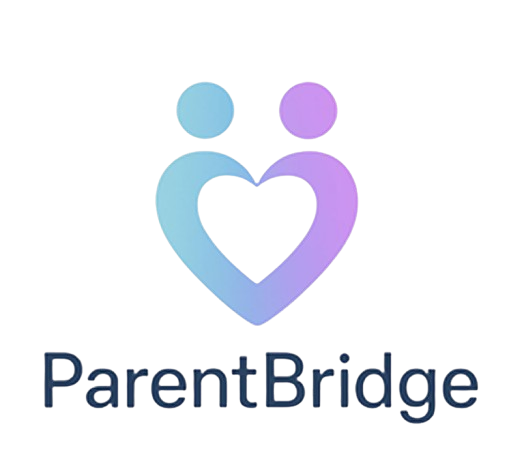

# ParentBridge

<p align="center">
  
</p>

<p align="center">
  A comprehensive co-parenting mobile application for parents and children to manage daily tasks, activities, and communication.
</p>

---

## 📱 About ParentBridge

ParentBridge is a powerful co-parenting application designed to help separated or divorced parents manage their children's daily tasks, schedules, and activities effectively. The app provides two operational modes:

- **Single Mode (Independent)**: For individual parents using the app independently
- **Bridge Mode**: For both parents to collaborate and share information seamlessly

---

## ✨ Key Features

### 🔐 Authentication & Onboarding
- User registration and login system
- OTP (One-Time Password) verification
- Password reset functionality
- Multi-step onboarding process
- Role selection (Single parent or Bridge mode)

### 📞 In-App Calling
- Voice calls between co-parents
- Call recording functionality
- Call history and details
- Incoming/ongoing call interface
- Mute and speaker controls

### 💬 Messaging System with AI Filter
- Real-time messaging between parents
- **AI-Powered Message Filtering**: Automatically detects and removes hostile language while preserving the message meaning
- **Tone Suggestions**: AI suggests alternative, more constructive ways to phrase messages
- Supportive, cooperative, neutral, and assertive tone detection
- View both filtered and unfiltered messages
- Flag hostile messages for review

### 📅 Calendar & Scheduling
- Shared calendar for both parents
- Event creation and management
- Holiday scheduling
- Child-specific activities
- Location and time tracking

### 💰 Expense Tracker
- Track child-related expenses
- Split expense calculation
- Expense categories (childcare, education, healthcare, etc.)
- Approval workflow (pending, approved, paid)
- Expense history and reporting

### 📂 Document Vault
- Secure document storage
- Document categorization
- Preview and download features
- Upload various file types (PDF, images, documents)

### ⚖️ Legal Records
- Store legal documents
- Court order management
- Important document tracking

### �/support_forum Community Support
- Anonymous support forum
- Post questions and experiences
- Community categories
- Reply and react to posts
- Privacy-focused (co-parent cannot see your contributions)

### ⚙️ Settings & Preferences
- Profile management
- Subscription management
- Notification preferences (messages, calls, calendar, expenses)
- Privacy policy and terms
- Help and support
- Co-parent information management

---

## 🛠️ Technical Details

### Technology Stack
- **Framework**: Flutter
- **Language**: Dart
- **State Management**: GetX
- **Architecture**: MVC (Model-View-Controller)

### Key Dependencies
| Package | Purpose |
|---------|---------|
| `get` | State management & routing |
| `flutter_svg` | SVG asset rendering |
| `flutter_screenutil` | Responsive UI design |
| `google_fonts` | Custom typography |
| `intl` | Internationalization |
| `dropdown_button2` | Custom dropdown menus |
| `flutter_secure_storage` | Secure data storage |
| `http` | API communication |
| `web_socket_channel` | Real-time communication |
| `shimmer` | Loading animations |

### Project Structure
```
lib/
├── app/
│   ├── common/                    # Shared utilities and widgets
│   ├── core/                      # Core services and constants
│   ├── modules/                   # Feature modules
│   │   ├── authentication/       # Login, signup, OTP
│   │   ├── calendar/              # Calendar and events
│   │   ├── call/                  # In-app calling
│   │   ├── chat/                  # Messaging system
│   │   ├── document_vault/        # Document management
│   │   ├── expense_tracker/       # Expense tracking
│   │   ├── home/                  # Home dashboard
│   │   ├── legal_records/         # Legal documents
│   │   ├── onboarding/           # User onboarding
│   │   ├── settings/              # App settings
│   │   ├── sign_up_process/       # Registration flow
│   │   ├── subscription/         # Subscription management
│   │   └── support_forum/        # Community support
│   └── routes/                   # App routing
├── common/                        # Common widgets and utilities
└── main.dart                      # App entry point
```

---

## 🎯 Premium Features (Subscription)

- Unlimited messages and message filtering
- Independent use – one parent can use even if the other does not
- Access to both filtered & unfiltered message views
- AI tone support to avoid unnecessary conflict
- Exportable PDF message transcripts (filtered & original)
- Flag and key hostile messages

---

## 🔒 Privacy & Security

- AI-powered message filtering that preserves privacy
- Secure data storage using encrypted storage
- Anonymous support forum contributions
- GDPR compliant data handling
- No manual review of private communications (except for technical troubleshooting)

---

## 📲 Installation

### Prerequisites
- Flutter SDK 3.8.1+
- Dart SDK 3.8.1+

### Build Instructions

```bash
# Clone the repository
git clone <repository-url>

# Navigate to project directory
cd parent_bridge

# Install dependencies
flutter pub get

# Run the app
flutter run
```

### Build APK
```bash
flutter build apk --release
```

### Build iOS
```bash
flutter build ios --release
```

---

## 📄 License

This project is proprietary software. All rights reserved.

---

## 📧 Contact & Support

For support inquiries: **myparentbridge@gmail.com**

---

<p align="center">
  Made with ❤️ for better co-parenting
</p>
